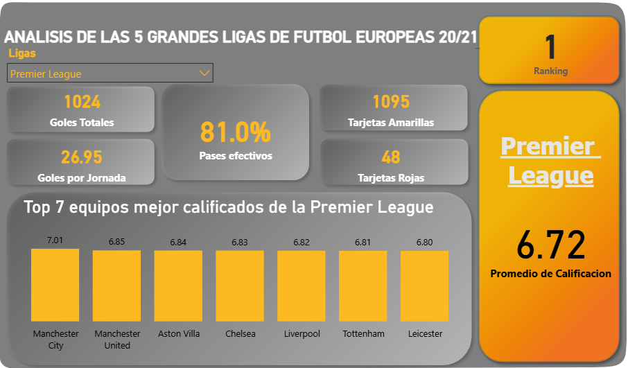
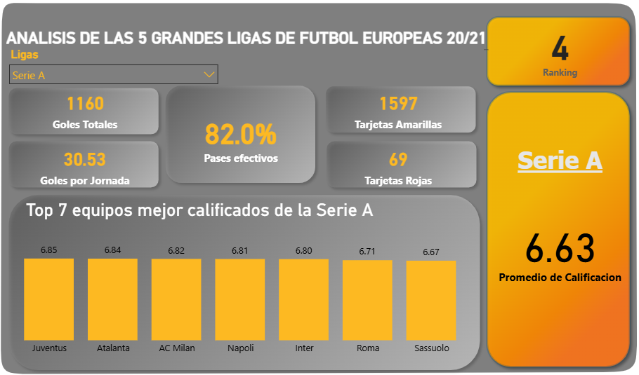
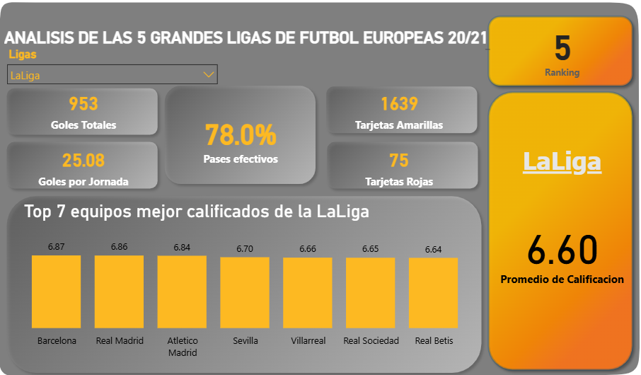

# -Proyecto-de-An-lisis-de-Datos-Ligas-Europeas-Power-BI-SQL
Se utilizó un dataset público con estadísticas de las cinco principales ligas de fútbol masculino en 
Europa. La información fue almacenada en una base de datos PostgreSQL, donde se aplicaron procesos de 
filtrado y transformación para realizar el análisis. Los resultados se presentan mediante un dashboard 
interactivo desarrollado en Power BI.
## 📊 Dashboards

### Premier League

### Ligue 1

### Bundesliga

### Serie A

### LaLiga

---

## 🧾 Dataset
Archivo:
